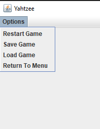

# Yahtzee Java

## Description
This is a implementation of the famous board game Yahtzee in Java, Users will be able to play singleplayer as well as multiplayer games. User's will also be able to save high scores locally on thier machine to keep track of thier high scores.

## Group Members
- **Patric Nurczyk**
- **Peter Hobbs**

## How To Play

### Main Menu

- SinglePlayer: Begins a New SinglePlayer Game, try to beat your high score!
- Multiplayer: Begins a New Multiplayer Game, Can be between 2 - 6 Players.

### Main Game Board

- Turn Order is signified above the dice and by the highlighted row on the score card.
- Each player will have a total of 13 turns
- At the end of the game the player with the most points wins!

### Taking Your Turn
- Your turn consists of you rolling the dice 3 times
- After the first roll, you will have the option to keep dice from being rerolled, and a counter will display showing the amount of rolls you have taken
-  (Note: Once you keep a die, you will not be able to unselect your choice, choose wisely before commit to keeping a die)

- The score card will also change, with the sections you have not selected yet being lit up. You can only select one section one time, the point calculations are as follows
    - **Aces**: Adds the total number of Ones
    
    In this scenario, there are 2 Ones so the section will be 1+1=2 Points
    - **Twos**: Adds the total number of Twos
    
    In this scenario, there are 2 Twos so the section will be 2+2=4 Points
    - **Threes**: Adds the total number of Threes
    
    In this scenario, there are 2 Threes so the section will be 3+3=6 Points
    - **Fours**: Adds the total number of Fours
    
    In this scenario, there are 2 Fours so the section will be 4+4=8 Points
     - **Fives**: Adds the total number of Fives
    
    In this scenario, there are 2 Fives so the section will be 5+5=10 Points
    - **Sixes**: Adds the total number of Sixes
    
    In this scenario, there are 2 Sixes so the section will be 6+6=12 Points
    - **Three Of A Kind**: Adds the total of all 5 dice, only if 3 or more dice are of the same number
    
    In this scenario, we have a three of a kind with the number 3, hence the score will be 4 + 3 + 5 + 3 + 3 = 18 Points
    - **Four Of A Kind**: Adds the total of all 5 dice, only if 4 or more dice are of the same number
    
    In this scenario, we have a four of a kind with the number 5, hence the score will be 5 + 5 + 3 + 5 + 5 = 23 Points
    - **Full House**: If there is a pair of 2 numbers along with a three of a kind, add 25 Points
    
    In this scenario, we have a pair of 6 and a three of a kind of 3, thus it is a full house.
    - **Small Straight**: If there is a ordered sequence of 4 dice, add 30 Points
    
    In this scenario, we have a 3, 4, 5, and a 6, creating a small straight
    - **Large Straight**: If there is an order sequence of 5 dice, add 40 Points
    
    In this scenario, we have a 2, 3, 4, 5, and a 6, creating a large straight
    - **Yahtzee**: If there is a five of a kind, add 50 Points
    
    In this scenario, all five dice are 3,
    so 50 points are awarded
    - **Chance**: Always adds the total of all the dice together no matter the combination.
- For any row, if the criteria is not met, then the row will be marked 0 and no points will be awarded
- Additional Scorecard Rules
    - If the total of the upper section(Aces - Sixes) is greater than or equal to 63, an upper bonus of 35 is added to the score card
    - If a Yahtzee is rolled again, and the Yahtzee row has been filled with 50 points, then...
        - 100 Point Bonus is awarded
        - Afterwards you must select the corresponding upper-section
        - If the corresponding upper section is already filled, then you can choose any row in the lower section, and get awarded points.
        - If all of the lower section have been filled, and the corresponding upper section row has been filled, the player must select a seperate upper row and will mark 0 points for that section
### Winning the Game
After all players have filled all thier sections, the game ends, the player with the highest points wins!

### Returning to Menu, Restarting Game
In the top left corner, is a drop down menu that will allow you to restart the current game, or return to the main menu and create a new game with a new number of players.

### Packing Game into a JAR / Running Game
```
jar cvfm hwx.jar manifest *
```
will create an executable JAR file
```
java -jar hwx.jar
```
will run the game